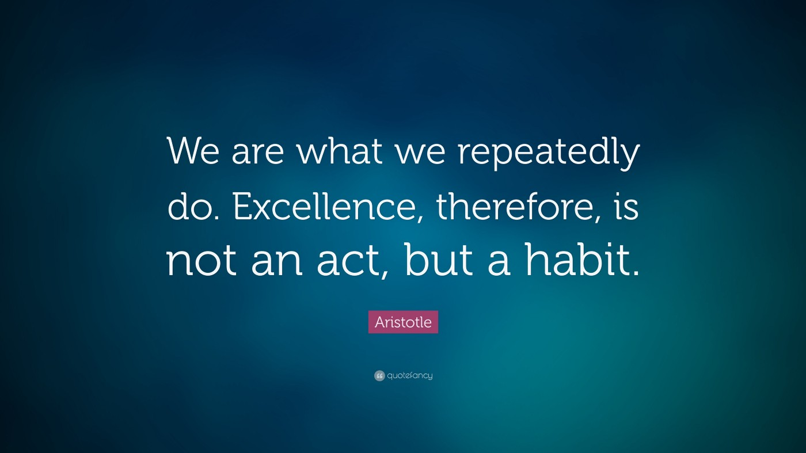
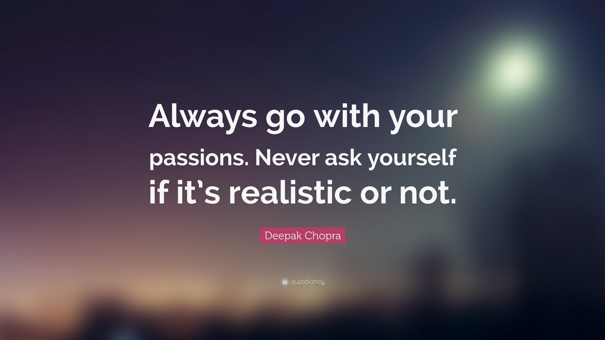
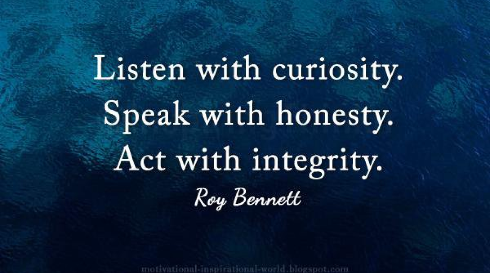

> [Andela](https://andela.com) is an American company that specializes in training software developers, its mission is to advance human potential by powering today’s teams and investing in tomorrow’s leaders. To accomplish this, [Andela](https://andela.com) was built on 4 core and important values which are EPIC.

EPIC stands for **Excellence, Passion, Integrity, and Collaboration**. These are the principles on which Andela was built upon and in which every Andelan or aspiring Andelans must possess. Let us talk more on what **EPIC** stands for:

### Excellence

[Excellence](https://en.wikipedia.org/wiki/Excellence) does not come easy as it takes dedication, preparation to attain Excellence, and Andela believes Andelans should embody themselves with this value i.e become lifelong learners.

### Passion

[Passion](https://en.wikipedia.org/wiki/Passion) is a core value that is very essential in achieving set goals. Andela believes it is one of those important value that gives you an edge over others when you are faced with challenges because the passion for something can be a motivating factor to keep one going.

### Integrity

[Integrity](https://en.wikipedia.org/wiki/Integrity) is yet another value every Andelans should possess. Andelans are expected to be accountable for actions taken, honest, do what is right no matter the conditions.

### Collaboration

[Collaboration](https://en.wikipedia.org/wiki/Collaboration) or ability to collaborate also is also a critical value to Andela. The collaborative force of the Andela team can never be overemphasized because with team effort more can be achieved and accomplished within a short period of time.

### Conclusion

> **EPIC** is what guides Andela, and seeing that I am an aspiring Andelan, I have also had to incorporate those values in my way of life and I think you should too.

Thank you for reading.

This article was originally published on [Medium](https://medium.com/@easybuoy/andela-ethics-an-invaluable-valuable-cae01c57142d)