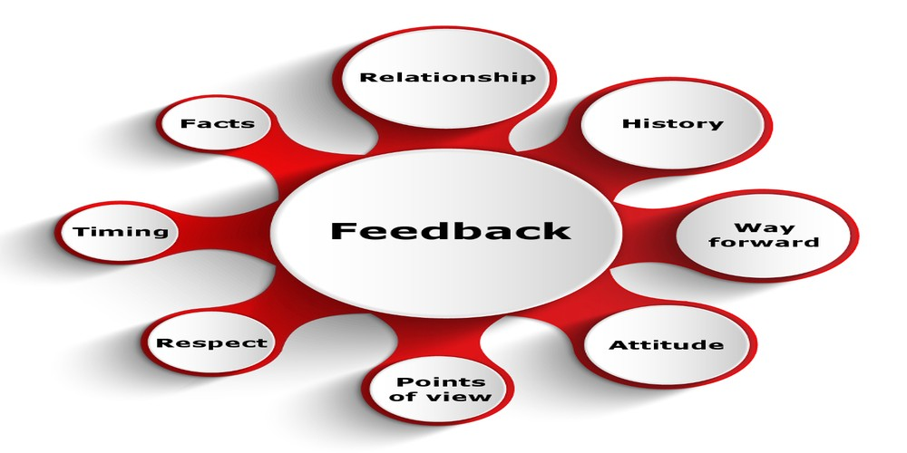
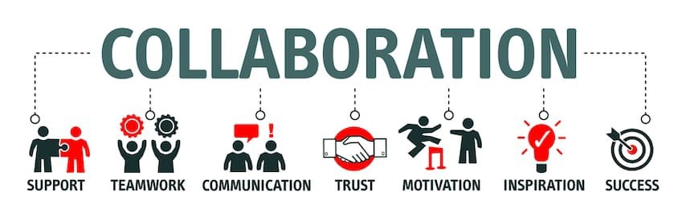

 >Today is the fourth day of the Andela boot camp. It has been challenging, interesting, motivating and I've had to unlearn somethings that I thought were right and learned them again *the right way*.

I've learned how to improve my coding skills and below are some of the areas I've improved on:

**Project management:** I've learned how to manage, track my projects using a pivotal tracker.

**Continuous Integration:** I've learned how to use continuous integration using Travis, coveralls, and codeclimate.

**Test Driven Development:** I've learned how to write code tests using mocha and chai.
Transpiling: I've learned how to use babel to transpile my es6 code to es5.

**Linting:** I've learned how to code using Airbnb style guide with eslint …amongst many others.

Aside from writing codes, I have learned some skills and qualities that would be of help in my day to day activities and I would be talking more on them.

### Giving and Receiving Feedback
 

Giving and receiving feedback helps one to improve their job performance.

 **Giving feedback:** I've learned to give feedback following the ASK principle which is it has to be Actionable, Specific and Kind.

**Receiving feedback:** I've learned to take feedback as a motivation to improve on my self and my works regardless of the nature of the feedback.

### Collaboration

CollaborationTeamwork is one key quality that most organization value and thrive on today. Andela boot camp has made me appreciate such quality. Now I consistently engage and work with others to learn new things and improve.

### Asking Questions

I've learned how to ask questions more now than before I started the Andela boot camp. The usefulness of asking questions, knowing the right questions to ask and knowing what audience to ask questions.

### Writing

Andela boot camp has taught me that being a world-class developer is not only about knowing how to write codes and as such I am learning how to be a good writer by writing this blog post and others. Feel free to check them out in the links below.

[Growth Mindset - The power curve for astute learning](https://medium.com/@ekunolaeasybuoy/growth-mindset-the-power-curve-for-astute-learning-c75422f5cf5b?source=post_page---------------------------)

[Andela Ethics: An Invaluable Valuable](https://medium.com/@easybuoy/andela-ethics-an-invaluable-valuable-cae01c57142d)

[MOCHA, an amazing Test Driven Development tool I encountered in preparation for Andela boot camp.](https://medium.com/@easybuoy/mocha-an-amazing-test-driven-development-tool-i-encountered-in-preparation-for-andela-boot-camp-ce718519e93e)

### You own your Learning

To be a world-class developer means I have to work on myself daily as there are new technologies, ways of going about things and a lot more. As such the responsibility to improve lies in no one hands but mine if I do not want to be left behind.

## Conclusion
> In few words, during the Andela boot camp I have realized that adding values to myself is not enough, but the quality of values I add matters more (quality in terms of how the value was acquired, and the processes involved) also most importantly is extending/sharing the values with others.

Thank you for reading 🙏🏾.
