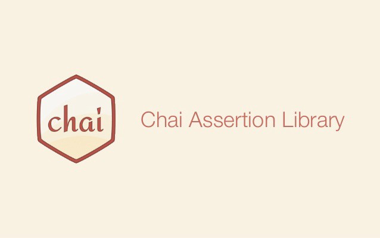

> Today I’ll be talking about this very interesting tool I encountered in preparation for [Andela](https://andela.com/) boot camp. In the course of the boot camp challenge and working with [Test Driven Development(TDD)](https://technologyconversations.com/2013/12/20/test-driven-development-tdd-example-walkthrough), one of the awesome tools I’ve had to familiarize myself with is [Mocha](https://mochajs.org/).


## What is Mocha?

[Mocha](https://mochajs.org/) is a feature-rich JavaScript test framework running on [Node.js](https://nodejs.org/en/) and in the browser, making asynchronous testing simple and fun.

## How To Install [Mocha](https://mochajs.org/) with [Npm](https://nodejs.org/en/)

Installing globally:

```
$ npm install --global mocha
```

Install as dev dependency:

```
$ npm install --save-dev mocha
```

Set up test script in package.json

```
"scripts": {
    "test": "mocha"
  }
  ```

  ## Basic Mocha Test
In your editor

```js
var assert = require('assert');
describe('Array', function() {
  describe('#indexOf()', function() {
    it('should return -1 when the value is not present', function() {
      assert.equal([1,2,3].indexOf(4), -1);
    });
  });
});
```
Back in the terminal:

```js
$ npm test

  Array
    #indexOf()
      ✓ should return -1 when the value is not present


  1 passing (9ms)
  ```

  ## Chai

  

  ### What is Chai?
  [Chai](https://www.chaijs.com/) is a BDD / TDD assertion library for nodejs and the browser that can be delightfully paired with any javascript testing framework.

  ### Assertion Types

[Chai](https://www.chaijs.com/) has several interfaces that allow the developer to choose the most comfortable namely:

**[Should](https://www.chaijs.com/guide/styles/)**

```js
chai.should();
foo.should.be.a(‘string’); 
foo.should.equal(‘bar’);
foo.should.have.lengthOf(3);
tea.should.have.property(‘flavors’).with.lengthOf(3);
```

**[Expect](https://www.chaijs.com/guide/styles/)**

```js
var expect = chai.expect;  
expect(foo).to.be.a('string'); 
expect(foo).to.equal('bar'); 
expect(foo).to.have.lengthOf(3); expect(tea).to.have.property('flavors').with.lengthOf(3);
```

**[Assert](https://www.chaijs.com/guide/styles/)**

```js
var assert = chai.assert;  
assert.typeOf(foo, 'string'); 
assert.equal(foo, 'bar'); 
assert.lengthOf(foo, 3);
assert.property(tea, 'flavors'); 
assert.lengthOf(tea.flavors, 3);
```

## Conclusion
> Testing is a very vital convention software developers must integrate into their project development process. While advising based on my experience, I will suggest Javascript developers should consider using Mocha when choosing a test framework as it is not only simple, it also has an amazing support.

Thank you for reading.

This article was originally posted on [Medium](https://medium.com/@easybuoy/mocha-an-amazing-test-driven-development-tool-i-encountered-in-preparation-for-andela-boot-camp-ce718519e93e)