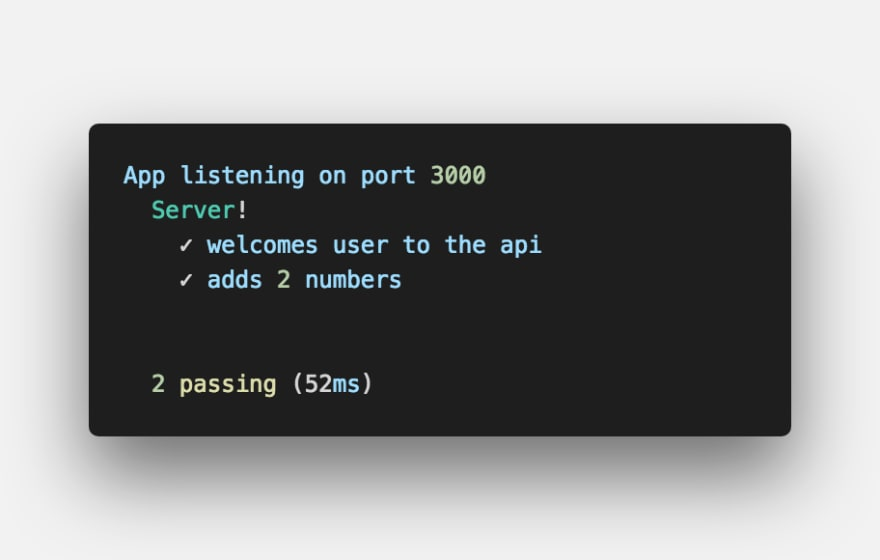

### What is Mocha?

[Mocha](https://mochajs.org) is a feature-rich JavaScript test framework running on Node.js and in the browser, making asynchronous testing simple and fun.

- Synchronous Test Example

```js
it("two plus two is four", () => {
  expect(2 + 2).to.equals(4);
});
```

- Asyncronous Test Code

```js
it("adds 2 numbers", done => {
  // perform asynchronous actions
  // write tests
  done(); // call the done function after test.
});
```

### What is Chai?

[Chai](https://www.chaijs.com) is a BDD (Behaviour-Driven Development) / TDD (Test-Driven Development) assertion library for nodejs and the browser that can be delightfully paired with any javascript testing framework.

#### Assertion Types

Chai has several interfaces from which developers can choose from. They are:

- **[Should](https://www.chaijs.com/guide/styles/#should)**

```js
chai.should();
foo.should.be.a("string");
foo.should.equal("bar");
foo.should.have.lengthOf(3);
tea.should.have.property("flavors").with.lengthOf(3);
```

- **[Expect](https://www.chaijs.com/guide/styles/#expect)**

```js
var expect = chai.expect;
expect(foo).to.be.a("string");
expect(foo).to.equal("bar");
expect(foo).to.have.lengthOf(3);
expect(tea)
  .to.have.property("flavors")
  .with.lengthOf(3);
```

- **[Assert](https://www.chaijs.com/guide/styles/#assert)**

```js
var assert = chai.assert;
assert.typeOf(foo, "string");
assert.equal(foo, "bar");
assert.lengthOf(foo, 3);
assert.property(tea, "flavors");
assert.lengthOf(tea.flavors, 3);
```

## Server Test

Now, I would be taking us through the process of setting up a basic Node API and writing tests for it.

First thing is to create our project folder and initialize it with npm to generate the `package.json` file.

```
npm init -y
```

Install dependencies by running the commands below on your terminal

```
npm i express --save
npm i mocha chai chai-http --save-dev
```

#### Setup Server

Create an `app.js` file in the root of your project and add code below to create a server with express and also endpoints that we would be testing.

```js
const express = require("express");

const app = express();

app.use(express.json());

app.get("/", (req, res) => {
  res.json({ status: "success", message: "Welcome To Testing API" });
});

app.post("/add", (req, res) => {
  const { num1, num2 } = req.body;
  const add = (num1, num2) => {
    return num1 + num2;
  };
  res.json({
    status: "success",
    result: "Welcome To Testing API",
    result: add(num1, num2)
  });
});

const PORT = process.env.PORT || 3000;

app.listen(PORT, () => console.log(`App listening on port ${PORT}`));

module.exports = app;
```

#### Setup Scripts

Add test script to `package.json` file.

```json
"scripts": {
    "test": "mocha"
  }
```

#### Write Tests

Create a test directory in your project, and then create an `app.test.js` file inside the `test` directory created.

**Note: The reason we're adding our tests to the `test` directory is that mocha searches for a test directory in your project by default, although this can be configured to suit your style. Find more [here](https://mochajs.org/#the-test-directory).**

Then add code below

```js
const app = require("../app");
const chai = require("chai");
const chaiHttp = require("chai-http");

const { expect } = chai;
chai.use(chaiHttp);
describe("Server!", () => {
  it("welcomes user to the api", done => {
    chai
      .request(app)
      .get("/")
      .end((err, res) => {
        expect(res).to.have.status(200);
        expect(res.body.status).to.equals("success");
        expect(res.body.message).to.equals("Welcome To Testing API");
        done();
      });
  });

  it("adds 2 numbers", done => {
    chai
      .request(app)
      .post("/add")
      .send({ num1: 5, num2: 5 })
      .end((err, res) => {
        expect(res).to.have.status(200);
        expect(res.body.status).to.equals("success");
        expect(res.body.result).to.equals(10);
        done();
      });
  });
});
```

At this point, your folder structure should look like the image below


To run the test, run the command below on your terminal.

```
npm test
```

Once the test is run, if the test passes, you should get a successful response on your terminal like the example shown below


...and if the test fails, an error response on your terminal like the example shown below


**Find the code used in this project on [Github](https://github.com/Easybuoy/node-api-testing)**

**Find more information on Mocha [here](https://mochajs.org/#getting-started)**

**Find more information on Chai [here](https://www.chaijs.com/guide)**

### Conclusion

In this article, we have been able to look at setting up testing with Mocha and Chai and also writing tests for our Node API. I would be improving on this article and project to integrate a Continuous Integration tool called Travis-CI.

If you have any questions or feedback, please feel free to reach out on [Twitter](https://twitter.com/easybuoy).
Thanks for reading 🙏🏾.
