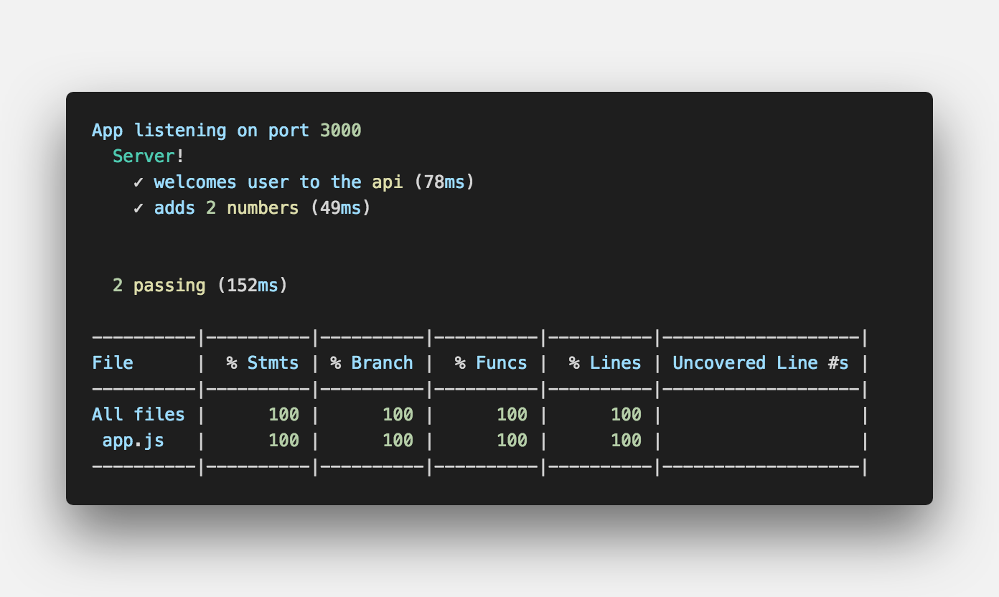

In this article, I would be integrating Continous Integration (CI) tools (Travis CI & Coveralls) to a project.

## **What is Continous Integration**
Continuous Integration (CI) is a software development practice where developers regularly merge their code changes into a central repository, after which automated builds and tests are run. Each commits triggers a build process, during which tests are run to determine if anything broke.

## **Why is this necessary**
CI tools are necessary for a project because
and it ensures quality code is been shipped/deployed.

In my previous article, I talked about writing tests for node API with Mocha and Chai, and I going to be building on the project used in the article described below.



## **Integrating Travis CI**
The first thing to create an account on [Travis CI](https://travis-ci.org), if you don't have one created yet.

After creating a Travis CI account, connect your Github to your Travis CI account.


Then select the repository you want to connect to Travis CI.


The next step is to create a `.travis.yml` file in the root of your project.

Then add the configuration below

```
language: node_js

node_js:
  - 10.14.1
```
> Note: In the configuration below, we specified the language as nodejs and the version of Nodejs we want Travis to install before running our tests. Also, different configurations could be specified based on the language used.

 After adding the configuration above to the created `.travis.yml` file, push changes to Github. After pushing, Travis CI would create a build and automatically run your tests. An example of a build is shown in the image below.


#### Environment Variables
If you've made use of environment variables in your project, you can also add them to Travis CI by following the steps shown in the image below


#### Travis CI Badge
You can add the Travis CI status badge to your project readme file by copying the markdown on Travis to your project readme file. An example is shown below.


## **Integrating Coveralls**
The first thing to create an account on [Coveralls](https://coveralls.io), if you don't have one created yet.

After creating a Coveralls account, connect your Github to your Coveralls account.


Then select the repository you want to connect to Coveralls. An example is shown in the image below


Back in our project, install the dependencies below 
```
npm i nyc coveralls --save-dev
```
> Note: The `nyc` package is for generating coverage for our tests. i.e how much lines our written test covered.

After installing the dependencies, add the scripts below to the `package.json` file.
```json
"coverage": "nyc npm test && nyc report --reporter=text-lcov | coveralls"
```
> Note: You can run coverage locally by running the command `npm run coverage` on your terminal. Example of coverage report below



Then edit the `.travis.yml` file by adding the command below
```
after_success:
  - npm run coverage
```

After adding the configuration above, push changes to Github. After pushing and Travis CI has created and runs the build for the test, the coverage would also run and then updating the coverage on your coveralls dashboard.

> Note: In cases where coverage does not reflect on your coveralls dashboard, create a `.coveralls.yml` file in the root of your project and add the configuration below and push changes to Github.
```
repo_token: as8dgas87dgadasdasd // repo_token is gotten from your coveralls dashboard.
```

#### Coveralls Badge
You can add the Coverage status badge to your project readme file by copying the markdown on Travis to your project readme file. An example is shown below.


## **Conclusion**
In this article, we have been able to look at how to integrate CI tools in our projects, and why it is needed to have them in our project.

> Find more on Continous Integration [here](https://www.thoughtworks.com/continuous-integration)
> Find more on Travis CI [here](https://docs.travis-ci.com/)
> Find more on Coveralls [here](https://docs.coveralls.io/)

If you have any questions or feedback, please feel free to reach out on [Twitter](https://twitter.com/easybuoy).

Thanks for reading.