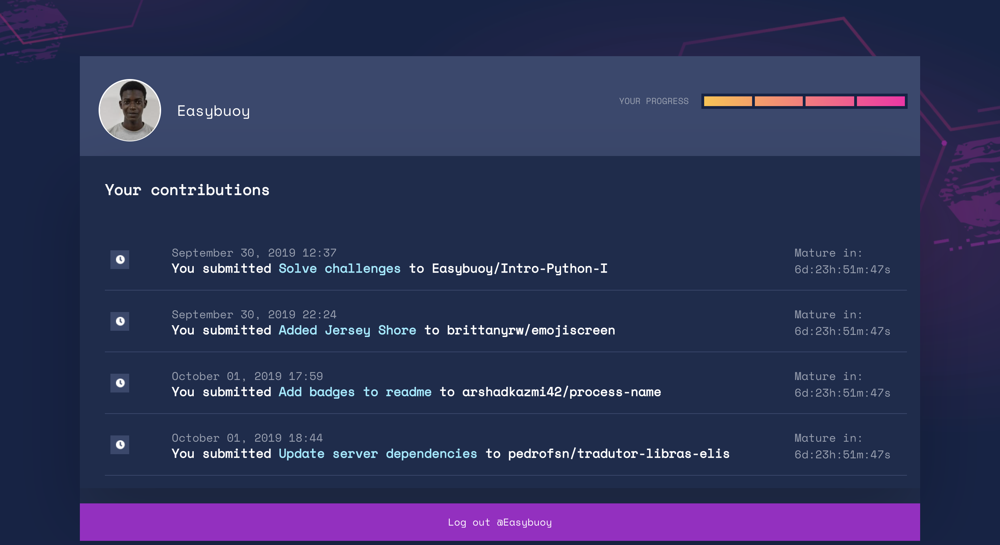

It's my first time participating in Hacktoberfest, and I am 75% done. I have made 3 contributions so far, in which 2 of them have been merged.

## Contributions

#### Emoji Screen
EmojiScreen is a listing of movies, TV shows and musicals depicted through emojis.

 Link to PR: https://github.com/brittanyrw/emojiscreen/pull/454

#### Process name
Process-name is an NPM package that allows you to get platform-specific application process name.
 

You can check out the package on npm [here](https://www.npmjs.com/package/process-name)

Link to PR: https://github.com/arshadkazmi42/process-name/pull/4

#### Translator Pounds Elis
Translator pounds elis is a course completion work in Information Systems from the Federal University of Goiás.

Link to PR: https://github.com/pedrofsn/tradutor-libras-elis/pull/7 

So far, participating in Hactoberfest and contributing to Open Source projects have been fun, and it has been a great experience so far.
 
## How you can contribute
To contribute, create an account on [Hacktoberfest](https://hacktoberfest.digitalocean.com), read the rules and participation details, then search the projects list for the project you want to contribute to.

You can also check your Hacktoberfest profile to see how you're doing.

## **Update**
Today (3rd October), I have completed the challenge, with 4 Pull requests merged. The last of them that I contributed to was *Oh My Zsh* terminal.

#### Oh My Zsh
Oh-My-Zsh is a delightful, open source, community-driven framework for managing your ZSH configuration.

Link to PR: https://github.com/robbyrussell/oh-my-zsh/pull/8194 

If you are looking to participate in Hacktoberfest, click [here](https://hacktoberfest.digitalocean.com) to register.