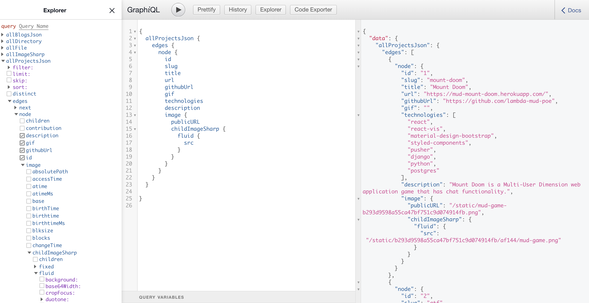

I recently built my [portfolio](https://ezekielekunola.com) website using Gatsby and I want to talk about my experience using Gatsby, what I enjoyed and the challenges I faced.

## **What is Gatsby**
Gatsby is a free and open-source framework based on React that helps developers build blazing-fast websites and apps. Gatsby can be used to build static sites that are PWA, high performant and follows the web standard. Read more about Gatsby [here](https://www.gatsbyjs.org).

### **What I enjoyed**
- **Performance**: Gatsby makes fast applications. Gatsby follows Google's PRPL (Push, Render, Pre-Cache, Lazy-load) standards for building apps that work well even during unreliable network connections. Find out more on why Gatsby is fast [here](https://www.gatsbyjs.org/blog/2017-09-13-why-is-gatsby-so-fast/) .

- **Easily get started**: You can easily get started with Gatsby, as Gatsby has lots of starters that can get you easily started. Checkout Gatsby starters [here](https://www.gatsbyjs.org/starters/?v=2)
- **It's basically React**: I had experience working with React already, so it was very easy for me to work with Gatsby.

- **Good Documentation**: Gatsby has good documentation, so it was easy for me to learn how to use packages and plugins like `gatsby-image`, `gatsby-source-filesystem` and so on when developing.

- **It uses GraphQL**: Gatsby uses GraphQL for managing data, and can be used for creating/generating pages, querying data and so on. I had always wanted to learn how to use GraphQL, Gatsby gave me an opportunity to do that. I learned how to use GraphQL when querying data on Gatsby. Learn more about why Gatsby uses Graphql [here](https://www.gatsbyjs.org/docs/why-gatsby-uses-graphql).

- **Plugins**: Gatsby has a plugin system that makes it easy to extend the functionality of Gatsby e.g Responsive image support, Typescript support. Find out more [here](https://www.gatsbyjs.org/plugins).

- **Good Community**: Gatsby has a good community and learning resources, and starters to help you get started quickly, and I also got to find solutions to challenges I had quickly.

### **Challenges I faced**

- When developing my portfolio, I mostly got the error `TypeError: Cannot read property 'internal' of undefined` when starting the application. To solve this error, I had to delete the **`.cache`** directory at the root of the project and restart the application by running `gatsby develop` on the terminal.
 

- I also ran into issues when using the GraphQL playground when developing, I changed my Graphql query in the code but was not reflecting on the Graphql playground until I had to refresh.

## **Conclusion**
In conclusion, developing with Gatsby has been fun and easy to work with, and proven to be the perfect tool for me to develop my portfolio with.

Find resources to learn more on Gatsby below

https://www.gatsbyjs.org/docs/awesome-gatsby

https://graphql.org/learn

If you have any questions or feedback about this article, feel free to leave a comment.

Thanks for reading.

This article was originally published on my [blog](https://blog.ezekielekunola.com).
