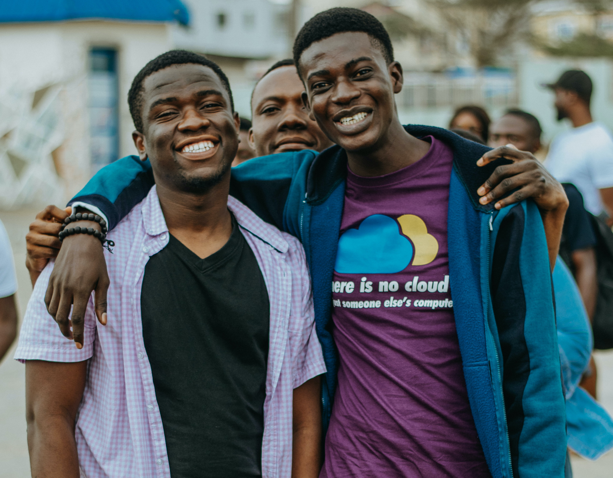

Sometime this year, I read [Prosper's 2018 year review](https://medium.com/@unicodeveloper/2018-in-review-shattering-expectations-9418f2d720cc) and it inspired me to do and accomplish alot, and is also the reason I've decided to also write my year review as well.

Today is the last day of 2019 ...
2019 has been a year of ups and downs for me, mostly ups (😁).
The first quarter of 2019 was not so pleasant for me, but I was able to bounce back, turn things around and have a great year.
2019 has been a great year for me, but it did not start with roses

At the beginning of the year, I did not plan to do some of the things I did, my only plan/goal was to become a better developer, all the other things like writing, mentoring came along
from people around me pushing me to greatness.

- got lambda via Andela
- released by Andela
- Started blogging about my experiences

## Writing ✍🏾

I started writing this year, and I started writing on my experiences with tools and technologies as well as teaching on how to ...
On ... I started writing in July and have written a total of 10 articles this year, including this one. I wrote my first ever blog on Deploying React app from Github to Netlify, it has been a way of giving back to the community

Writing has not exactly been easy for me, I was not able to write as much this year as I would have loved to. I'm still trying to figure out the best way that works for me, what topics to write on, but I believe with time
I want to give special shoutouts to [Johnson](https://dev.to/ogwurujohnson) and [Chinedu](https://dev.to/nedsoft) for their support and motivation, and for helping me find bugs in my articles 🤪.

I've gotten some good feedback from people as to how my articles helped them one way or another, which just motivates me to want to do more

Top 5 articles

- [Testing Node API with Mocha & Chai](https://www.blog.ezekielekunola.com/testing-node-api-with-mocha-chai)
- [Deploying React App from Github to Netlify](https://www.blog.ezekielekunola.com/deploying-react-app-from-github-to-netlify)
- [Setting up a Node API with Postgres and Knex](https://www.blog.ezekielekunola.com/setting-up-a-node-api-with-postgres-and-knex)
- [Getting started with React & Apollo Client](https://www.blog.ezekielekunola.com/getting-started-with-react-apollo-client)
- [My first experience with Gatsby](https://www.blog.ezekielekunola.com/my-first-experience-with-gatsby)

## Work & Personal Projects 👨🏾‍💻

### Personal Projects

This year was my most active year on Github, I made ... contributions working on personal projects, as well as open source contributions.

<!-- I built my [Portfolio](https://www.ezekielekunola.com) and [Blog]() -->

Some of the fun projects I developed are:

- [Portfolio](https://www.ezekielekunola.com): My Personal Online Portfolio
- [Blog](https://www.blog.ezekielekunola.com): Was built using one of the Gatsby starters, I'm planning on building mine, if I have the time
- [Use My Tech Stuff](https://ls-umts.netlify.com)
- [Marvel Comics](https://marvel-comic-characters.netlify.com): Fun project I decided to build with Marvel's API
- [Anonymous Team Feedback](https://anonymous-feedback-fe.herokuapp.com):
- [Trackdrills](https://app.trackdrills.com): **WIP**
- [Multi-User Dimension Game](https://mud-mount-doom.herokuapp.com): This project was built with React & Python to further establish my understanding of Data Structures and Algorithms.

  
  <figcaption>My 2019 Github graph</figcaption>

### Work

- [Andela](http://andela.com): At the beginning of the year, I was working for [Andela](http://andela.com), and it was a great experience for me, I met lots of fantastic people with great minds, and people
  who pushed me to give my very best. On September 17, however, Andela laid off about 400 engineers, sadly I was among them (read more [here](https://andela.com/insights/the-future-of-andela)).
  Andela invested alot in me, and I'd be foerever grateful for the experience and the support that Andela showed, even after we were laid off.
  
  I started the year working for Andela, but on September, I was part of the people Andela laid off ....
  
  I met and connected with lots of great and amazing people this year from around the world.

  
  <figcaption>Andela Party 😁</figcaption>

- [Lambda School](https://lambdaschool.com): I started work as a Technical Team Lead at [Lambda School](https://lambdaschool.com) in November, and it has been quite an experience. 

  I work with people from diverse backgrounds, and its been an opportunity for me to improve my leadership and communication skills.
  My responsibilities includes ....

  
  <figcaption>Team Meetng (Awesome times 😅)</figcaption>

  
  <figcaption>Lambda School Lagos Hangout</figcaption>

## Community

### Open Source

I contributed to several open source projects l, as well as participating in the hactoberfest challenge, which opened my eyes to many things

- [Gatsby](https://github.com/gatsbyjs/gatsby)
- [Developer Portfolios](https://github.com/Easybuoy/developer-portfolios)
- [Oh-my-zsh](https://github.com/ohmyzsh/ohmyzsh)

### Mentorship

Mentored in the Andela DevCTraining

### Events

I attended several tech conferences (concatenate, unstack) in Nigeria, and I hope to start speaking at conferences soon

  
  <figcaption>
    L-R: Me, Chinedu, Benjamin, Noble, Yusuf (Concatenate conf event)
  </figcaption>

  
  <figcaption>
    L-R: Ebenezer, Me (had to take a picture with Ebenezer as evidence incase he blows😆)
  </figcaption>

  
  <figcaption>L-R: Chinedu, Me</figcaption>

  
  <figcaption>La Campagne Tropicana Resort</figcaption>

  
  <figcaption>L-R: Jessie, Basil, Me</figcaption>

## Life

- Reading 📖: I have never been a fan of reading books 😩, even though I've tried to. This year, I managed to finish reading a book titled **Eat a frog**, by Brian Tracy. My target next year is to read at least 5 books.
- Travelling 🛫: I have been stuck in Nigeria, and next year I plan on visitning at least 2 countries.
- Workout 🏋🏾‍♀️: I have ever being so lazy at going to the gym to workout😅. I always find reasons to avoid going there

## Plans for 2020

2020 is a year of doing more of the things I kickstarted this year.

- Contribute more to open source
- Write more
- Start mentoring
- Travel (Did little or no traveling this year, travel to at least 2 countries.
- Start working out

---

#### Shoutouts

Thanks to **Johsnon, Chinedu, Yusuf, Kells, Chidimma, Xavier(XROLE), Ebenezer, Vincent, Gabe, Delba** for making 2019 🔥, for encouraging me and providing the much crucial support. I appreciate you guys
and I'm really glad to have met you all 🤗.

---
