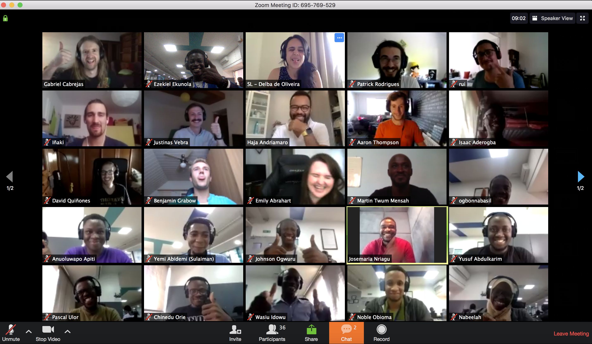
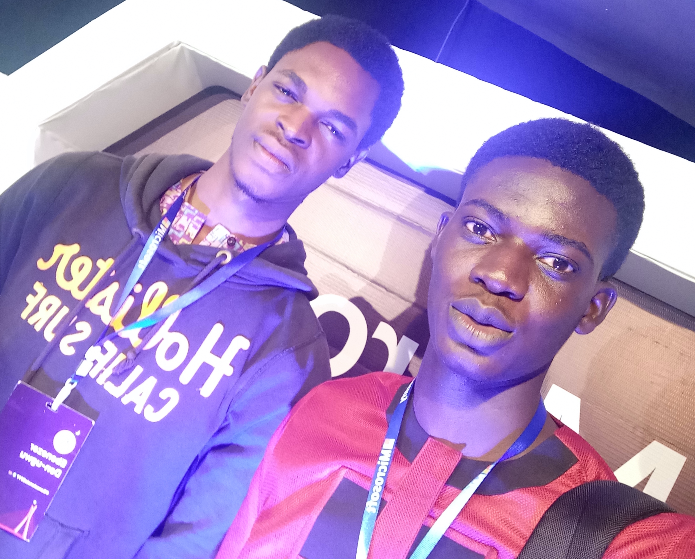

Sometime this year, I read [Prosper's 2018 in review](https://medium.com/@unicodeveloper/2018-in-review-shattering-expectations-9418f2d720cc) and it inspired me to do and accomplish alot, and is also the reason I've decided to also write my year review as well.

Today is the last day of 2019 ...
2019 has been a great year for me, but it did not start with roses

At the beginning of the year, I was I'll for a while ...

- got Mandela
- got sick
- got lambda via Andela
- released by Andela
- Read a book (Eat a frog, by Brian Tracy)
- Started blogging about my experiences

## Writing ✍🏾

I started blogging this year, and I started writing on my experiences with tools and technologies as well as teaching on how to ...
On ... I started writing in July and have written a total of 10 articles this year, including this one. I wrote my first ever blog on Deploying React app from Github to Netlify, it has been a way of giving back to the community

Top 5 articles

- [Testing Node API with Mocha & Chai](https://www.blog.ezekielekunola.com/testing-node-api-with-mocha-chai)
- [Deploying React App from Github to Netlify](https://www.blog.ezekielekunola.com/deploying-react-app-from-github-to-netlify)
- [Setting up a Node API with Postgres and Knex](https://www.blog.ezekielekunola.com/setting-up-a-node-api-with-postgres-and-knex)
- [Getting started with React & Apollo Client](https://www.blog.ezekielekunola.com/getting-started-with-react-apollo-client)
- [My first experience with Gatsby](https://www.blog.ezekielekunola.com/my-first-experience-with-gatsby)

## Work & Personal Projects 👨🏾‍💻

#### Personal Projects

I met and connected with lots of great and amazing people this year from around the world.

I built my [Portfolio](https://www.ezekielekunola.com) and [Blog](https://www.blog.ezekielekunola.com)

  
  <figcaption>My Github graph</figcaption>

#### Work

I started the year working for Andela, but on September, I was part of the people Andela laid off ....

  
  <figcaption>
   Andela Party
  </figcaption>

- Andela
- Lambda School

- Started Team Lead Role at Lambda School

  
  <figcaption>Team Meetng (Awesome times 😅)</figcaption>

## Community

#### Open Source

I contributed to several open source projects l, as well as participating in the hactoberfest challenge, which opened my eyes to many things
- [Gatsby](https://github.com/gatsbyjs/gatsby)
- [Developer Portfolios](https://github.com/Easybuoy/developer-portfolios)
- [Oh-my-zsh](https://github.com/ohmyzsh/ohmyzsh)
#### Mentorship
Mentored in the Andela DevCTraining

#### Events
I attended several tech conferences (concatenate, unstack) in Nigeria, and I hope to start speaking at conferences soon

  
  <figcaption>
    L-R: Me, Chinedu, Benjamin, Noble, Yusuf (Concatenate conf event)
  </figcaption>

  
  <figcaption>
    L-R: Ebenezer, Me (had to take a picture with Ebenezer just incase he blows)
  </figcaption>

  
  <figcaption>L-R: Chinedu, Me</figcaption>

  
  <figcaption>Lambda Hangout</figcaption>

  
  <figcaption>L-R: Jessie, Me</figcaption>

## Life

#### Reading 📖

I have never been a fan of reading books 😩, even though I've tried to. This year, I managed to finish reading a book titled .... My target next year is to read at least 5 books.

## Plans for 2020

- Contribute more to open source
- Write more
- Start mentoring
- Travel (Did little or no traveling this year
