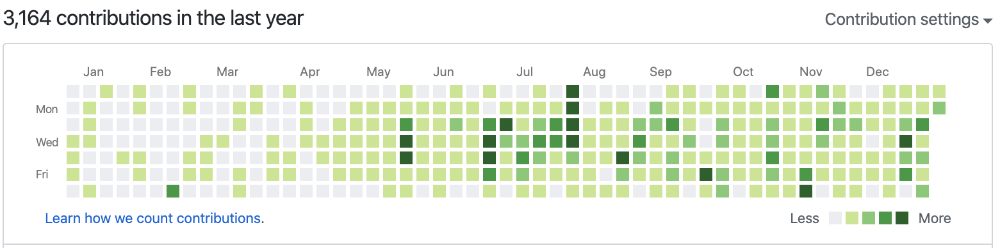
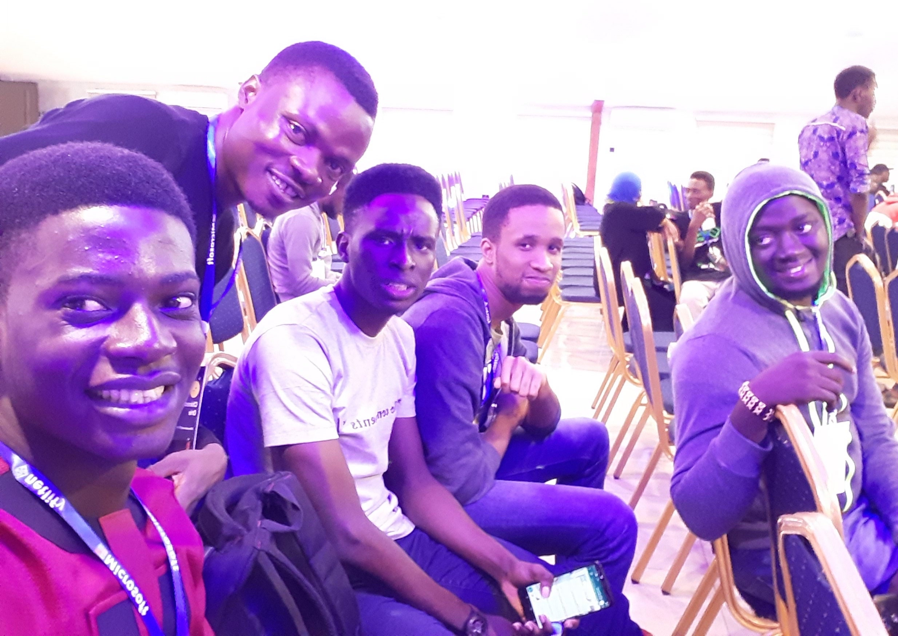

Early this year, I read [Prosper's 2018 year review](https://medium.com/@unicodeveloper/2018-in-review-shattering-expectations-9418f2d720cc) and it inspired me to do and accomplish a lot, and is also the reason I've decided to also start writing my year review as well.

2019 has been a year of ups and downs for me, mostly ups 😁. The first quarter of 2019 was not so pleasant for me, but I was able to bounce back, turn things around and have a great year.

At the beginning of the year, I did not plan to do some of the things I did, my only plan/goal was to become a better developer, all the other things like writing, mentoring came along
from people around me pushing me to greatness.

## Humble moment of 2019 🙇🏾‍♂️
I took a technical interview sometime this year for a position at a company, turned out it was to be taken on Codility. It was my first time hearing/interacting with the platform, I was used to Hackerrank mostly then.

Fastforward, I took the test on Codility, I think there were 3 questions. I solved about 2 of them, with sample tests passing, only for me see the results and I got **0%**.

  
  <figcaption>
    What!!! How??
  </figcaption>

Apparently, the Example test cases did not count toward the final score results. I knew I wasn't good with Algorithms and Data Structures then but I never expected to get a 0 in a coding challenge.
It was truly an humbling experience that just made me realize I had lots of things I still needed to learn. 

Since then I've taken courses on Data Structures & Algorithms, and also solved coding challenges from time to time.

## Work & Personal Projects 👨🏾‍💻

### Work

- [Andela](http://andela.com): At the beginning of the year, I was working for [Andela](http://andela.com) as a Software Engineer, and it was a great experience for me, I met lots of fantastic people with great minds who pushed me to give my very best. On September 17, however, Andela laid off about 400 engineers (read about it [here](https://andela.com/insights/the-future-of-andela)), sadly I was one of them.
  
  Andela invested a lot in me, and I'd be forever grateful for the experiences and the support that Andela showed, even after we were laid off.

  
  <figcaption>Andela Party 😁</figcaption>

  
  <figcaption>L-R: Chinedu, Me</figcaption>

- [Lambda School](https://lambdaschool.com): I started work as a Technical Team Lead at [Lambda School](https://lambdaschool.com) in November, and it has been quite an experience.

  I work with people from diverse backgrounds, and its been an opportunity for me to improve my leadership and communication skills.
  
  Some of my responsibilities as a Technical Lead includes:
  - Leading a team of 6 learners that emulates a real work environment using the agile methodology.
  - Mentoring 6 learners on how to learn effectively and solve programming problems.
  - Providing daily feedback and issue resolution of all curriculum through slack help channel or code review.
  - Delivering one-on-one feedback and code review on a daily basis.
  - Reviewing student code and giving feedback on areas of improvement.
  - Leading daily standup meetings to build camaraderie, facilitate sharing of ideas and work progress, and provide guidance for that week's study material.

  
  <figcaption>Team Meetng (Awesome times 😅)</figcaption>

  
  <figcaption>Lambda School Lagos Hangout</figcaption>

### Personal Projects

This year was my most active year on Github, I made 3,093 contributions working on personal projects, as well as open source contributions in 2019.

Some of the fun projects I developed are:

- [Portfolio](https://www.ezekielekunola.com): I built my Portfolio with Gatsby to learn the amazing prowess of Gatsby and GraphQL.
- [Blog](https://www.blog.ezekielekunola.com): This Was built using one of the [Gatsby starters](https://www.gatsbyjs.org/starters/?v=2), I also used this as an opportunity to learn more about Gatsby & GraphQL.
- [Use My Tech Stuff](https://ls-umts.netlify.com)
- [Marvel Comics](https://marvel-comic-characters.netlify.com): This was a fun project I decided to build with Marvel's API.
- [Anonymous Team Feedback](https://anonymous-feedback-fe.herokuapp.com):
- [Trackdrills](https://trackdrills.com): **WIP**
- [School In The Cloud](https://distracted-stonebraker-f30c76.netlify.com): This project was built for demonstrating my understanding of Flexbox.
- [Multi-User Dimension Game](https://mud-mount-doom.herokuapp.com): This project was built with React & Python to further establish my understanding of Data Structures and Algorithms.

  
  <figcaption>My 2019 Github graph</figcaption>

## Writing ✍🏾

I started writing around July 2019 and I have written a total of 10 articles this year, including this one. I write on my experiences with tools and technologies as well as teaching on how to use different tools.
 My first ever article was on [Deploying React app from Github to Netlify](https://www.blog.ezekielekunola.com/deploying-react-app-from-github-to-netlify).

Writing has not exactly been easy for me, I was not able to write as much this year as I would have loved to. I'm still trying to figure out the best way that works for me, what topics to write on, but I believe with time
I want to give special shoutouts to [Johnson](https://dev.to/ogwurujohnson), [Chinedu](https://dev.to/nedsoft) and Xavier for their support and motivation, and for helping me find bugs in my articles 🤪.

I've gotten some good feedback from people as to how my articles helped them one way or another, which just motivates me to want to do more.

Top 5 articles of the year 

- [Testing Node API with Mocha & Chai](https://www.blog.ezekielekunola.com/testing-node-api-with-mocha-chai)
- [Deploying React App from Github to Netlify](https://www.blog.ezekielekunola.com/deploying-react-app-from-github-to-netlify)
- [Setting up a Node API with Postgres and Knex](https://www.blog.ezekielekunola.com/setting-up-a-node-api-with-postgres-and-knex)
- [Getting started with React & Apollo Client](https://www.blog.ezekielekunola.com/getting-started-with-react-apollo-client)
- [My first experience with Gatsby](https://www.blog.ezekielekunola.com/my-first-experience-with-gatsby)

## Community 

### Open Source

I always wandered what contributing to Open Source meant 😅 and how it was possible, well I was able to find out this year. I contributed to several open source projects this year as well as participating for the first time in the [hacktoberfest challenge](https://hacktoberfest.digitalocean.com).
I also wrote about my contributions to the Hacktoberfest challenge [here](https://www.blog.ezekielekunola.com/my-hacktoberfest-contributions).

Some of the Open Source projects I contributed to in 2019 below: 
- [Gatsby](https://github.com/gatsbyjs/gatsby)
- [Developer Portfolios](https://github.com/Easybuoy/developer-portfolios)
- [Oh-my-zsh](https://github.com/ohmyzsh/ohmyzsh)

  
  <figcaption>
    Hacktoberfest Swag
  </figcaption>

### Events

This year, I was only able to attend the [concatenate](https://www.concatenate.dev) and [unstack](https://unstack.dev) events held in Lagos, Nigeria.

At the events I learned alot with topics ranging from Design, Communication, Accessibility, Building JAMStack apps, GraphQL & Gatsby, Functional Programming and so on. I was also able to network and connect with other people in the tech industry, and also find out the interesting things they've been building and developing.

I just want to thank the organizers of the events for putting them together. It was an awesome experience for me, and I can't wait to see what they have for us come 2020 🤗.

  
  <figcaption>
    L-R: Me, Chinedu, Benjamin, Noble, Yusuf (Concatenate conference)
  </figcaption>

### Mentorship

- [DevCTraining](https://devctraining.andela.com): I was able to be part of the mentors of the [DevCTraining](https://devctraining.andela.com) program where I mentored Mentored participating learners, provided technical support, reviewed their code, and also delivered feedback to them.

## Life

- Reading 📖: I have never been a fan of reading books 😩, even though I've tried to. This year, I managed to finish reading a book titled **Eat a frog**, by Brian Tracy. My target next year is to read at least 5 books.
- Travelling 🛫: I have been stuck in Nigeria all year, I was merely moving from states to states.
- Workout 🏋🏾‍♀️: I have ever being so lazy at going to the gym to workout😅. I always find reasons to avoid going there

---

#### Shoutouts 📣

Thanks to **Johsnon, Chinedu, Kelsey, Chidimma, Xavier(XROLE), Ebenezer, Gabe, Delba** for making 2019 🔥, for encouraging, guiding, pushing, and providing me with the much crucial support. I appreciate you guys
and I'm really glad to have met you all 🤗.

---

## Plans for 2020

- Writing: In 2020, I'm looking to write way more than I did this year.
- Open Source: In 2020, I want to contribute more to open source projects than I did in 2019.
- Community: I want to be more involved in the developer community,  
- Travel: I did little no travelling in 2019. Next year I'm looking to travel to at least 2 countries. 
- Workout: Definately looking to get a Gym membership, and actually start working out.

2020 is a year of doing more of the things I kickstarted this year. Looking forward to an awesome and exciting year ahead 🚀🚀🚀.