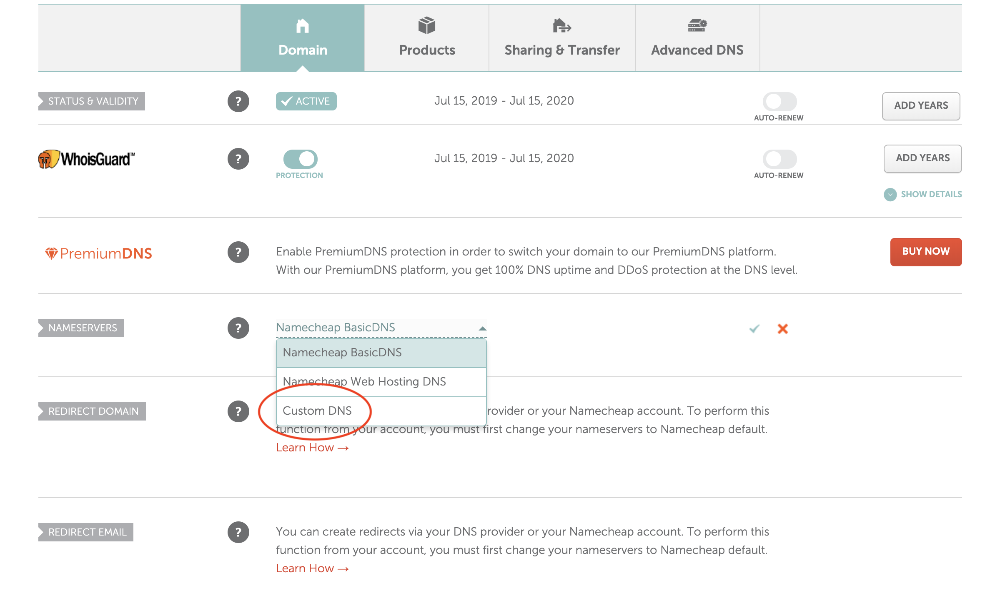
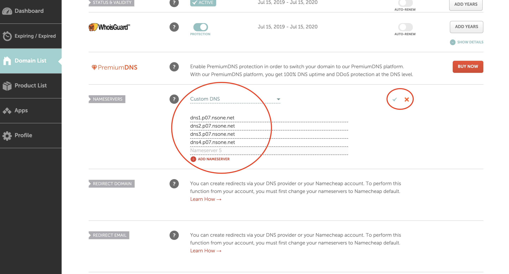

In this article, I would be showing how to connect a Namecheap domain to an application hosted with Netlify.

First step is to have [Netlify](https://www.netlify.com) and [Namecheap](https://www.namecheap.com) accounts setup.

Once that has been done, go ahead and purchase your domain on [Namecheap].

It is assumed that you have an application on [Netlify] and that you've also purchased your domain on [Namecheap].

> If you've not done the above yet, please take the time to do them before proceeding reading this article.

After purchasing your domain on [Namecheap], navigate to your dashboard you should see the purchased domain there. Click on the manage button on the far right corner of the domain.

Scroll down to the `Nameservers` section, click on the dropdown and change it from `Namecheap BasicDNS` to `Custom DNS`. See example in the image below

Then navigate to your application on Netlify and click on Domain Settings or Setup Custom Domain

Then add your domain and click on the verify button. Netlify would try to validate the domain.

Once that has been done, you can then get the dns on Netlify.

Navigate back to Namecheap, and add the dns servers there one at a time. After adding them, click on the tick icon to the right to save them.

And that's it, we're done. You would need to wait for 1–5 minutes for Netlify to propagate, after that your web page can now be accessed by the custom domain. 

Netlify will issue your domain free SSL certificates, so you would not need to worry about setting up HTTPS on your own.
