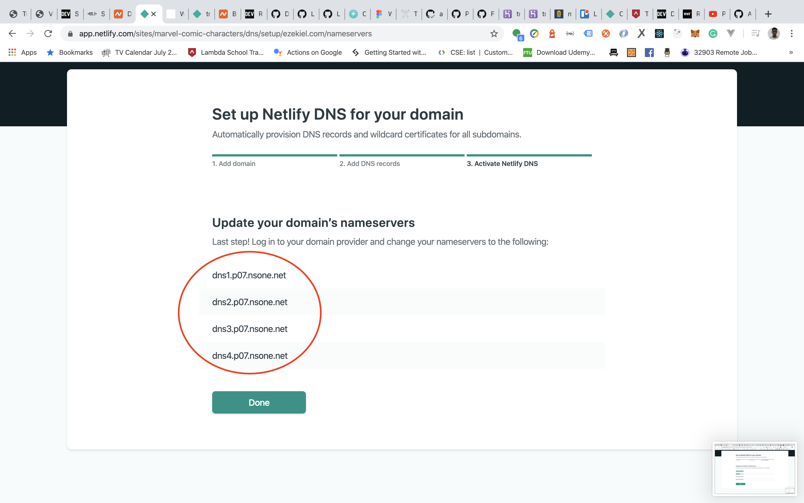

In this article, I would be showing how to connect a Namecheap domain to an application deployed with Netlify.

The first step is to have [Netlify](https://www.netlify.com) and [Namecheap](https://www.namecheap.com) accounts setup. Once that has been done, go ahead and purchase your domain on [Namecheap](https://www.namecheap.com) and also deploy your application to [Netlify](https://www.netlify.com).

> Note: It is assumed that you have an application hosted on Netlify and that you've also purchased your domain on Namecheap.

After purchasing your domain on Namecheap, navigate to your dashboard you should see the purchased domain there. Click on the manage button on the far right corner of the domain.

Scroll down to the **NAMESERVERS** section, click on the dropdown and change it from **Namecheap BasicDNS** to **Custom DNS**. See example in the image below

Navigate to your application on Netlify and click on the Domain Settings or Setup Custom Domain

Add your domain in the input field and click on the verify button. Netlify would try to validate the domain.

After adding the domain, click on the options dropdown to the right of the domain you just added, and select **Set Up Netlify DNS**. See example in the image below

Click through till you get to the point where Netlify shows a list of Nameservers. See example in the images below

Navigate back to Namecheap, and copy each of the DNS servers one at a time to the **NAMESERVERS** section of Namecheap. After adding them, click on the check icon to the right to save them. See example in the image below

And that's it, we're done. You would need to wait for 1–5 minutes for Netlify to propagate, after that your web page can now be accessed by the custom domain.

Netlify will issue your domain free SSL certificates, so you would not need to worry about setting up HTTPS on your own.
