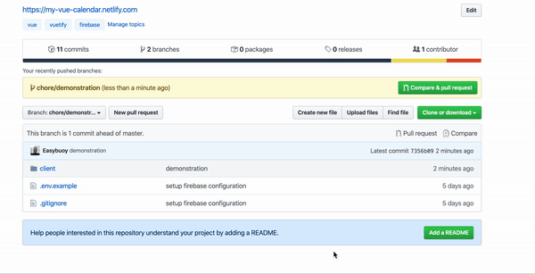

In this article, We will be going through the process of deploying a Vue application from Github to Netlify.

If you have a project structure where the Vue app is **NOT** nested in a sub-directory like in the example shown below


You can use the following steps to deploy:

- Push your code to Github
- Connect your Github account to your Netlify account
- Select the project you want to deploy
- Add commands
  - Build Command **(npm run build)**: This is the command that would be run for every build/deployment on Netlify. The Vue command for building and bundling our files is **`npm run build`**. 
  - Publish Directory **(dist)**: This is the folder that contains the files that was generated from the build command. After running the build command, a **`dist`** folder is generated and it contains our minified and compiled code.
- Deploy project

See example in the image below


In a case where your Vue application is available in a nested directory like the example shown below



**Note that the Vue project in the example above is nested in a client directory.**

Add a **`netlify.toml`** file to the root of your project, and add the configuration below to the file.

```
[build]
  command = "npm run build"
  publish="dist"
  base = "client"
  # The base directory should be the path to the nested Vue project
```

Once added, push the changes to Github. Netlify should automatically deploy the changes, if not, deploy the changes manually.

**Note:** _`netlify.toml` is a configuration file where you can specify how Netlify should build/run your application. A lot can be accomplished with the `netlify.toml` file. Find out more about the `netlify.toml` file [here.](https://www.netlify.com/docs/netlify-toml-reference/)_

## Routing

If you've made use of routing in your project, and you want to load a particular route straight from your URL, you would run into an issue where Netlify would throw an error ("page not found") as shown in the example below


To solve/fix the issue, you can add the following code below to your `netlify.toml` file.

```
[[redirects]]
  from = "/*"
  to = "/index.html"
  status = 200
```

Once added, push the changes to Github and re-deploy the project. Once deployed, your application should no longer throw errors. See the example below.


## Environment Variables

If you've made use of environment variables in your project, you can also add them to Netlify by following the steps shown in the image below


Note that If you've created the Vue application using `vue-cli`, you need to add the **`VUE_APP`** prefix to all your environment variables.

## Conclusion

In this article, we've been able to take a look at how to deploy a Vue application from Github to Netlify, how to fix routing issues that can come up after deployment and well as how to add environment variables on Netlify.

If you have any questions or feedback about this article, feel free to reach out.

Thanks for reading.
