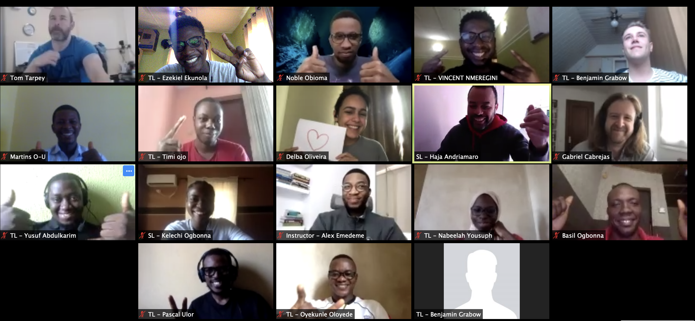

November 2019 I started working as a Technical Team Lead at [Lambda School](https://lambdaschool.com). 6 months down the line I'm writing about the experience and the lessons learned along the way.

The Technical Team Lead position entailed managing a cross-functional diverse team remotely by leading standup meetings, delivering one-on-one feedback, code reviews, and much more.

During my time as a Technical Team Lead, I led a team of 6 software engineers that built a workout tracker product within 2 months called [Trackdrills](https://trackdrills.com). We made use of agile methodology, carried out customer, user, and technical research before building out the product. 

Product presentation:
<iframe style="margin:0 auto;" width="500" height="300" src="https://www.youtube.com/embed/SfKx1s_eONA" frameborder="0" allow="accelerometer; autoplay; encrypted-media; gyroscope; picture-in-picture" allowfullscreen></iframe>

Application Link: https://trackdrills.com

The second stage was to guide another team of 6 through the process of learning Python, Data structures and Algorithms and also in building projects to demonstrate what was learned.

# **Lessons Learned**

- **Effective Communication**

    Communication is key and very integral when working generally, and as a Team Lead it was important I communicated well and professionally with the team. I learned to communicate on time, communicate changes to the schedule and team meeting early and also to follow up on recent conversations. I was also able to manage expectations by always communicating with the stakeholders of the project frequently.

- **Preparation is Key**

    I learned to always prepare ahead for team meetings by having the goal and the objective of the meeting in mind. I also plan an agenda and also questions that can be asked during the meeting as well. It helped in getting value out of team meetings.

- **Giving & Receiving Feedback**

    The Team Lead position required giving individual feedback to the team I was managing weekly, I learned to give ASK (Actionable, Specific and Kind) feedback and to highlight what the engineers did well each week and also what they could improve on. Each team member provided feedback to their Team Leads on a weekly basis as well, so I've had to reflect on their feedback and make improvements where needed based on their feedback.

- **Leading by example**

    Being the Team Lead, the team looks up to my actions, character, and behavior, so I've had to always attend and host team meetings on time and on schedule, always be professional during team meetings, take responsibility and apologize when I'm late to team meetings.

- **Patience & Empathy**

    People face different challenges in life which would sometimes affect their performance at work, I learned to always try to find out what's going on with my team members asides work and be patient with them.
    Even when having though conversations, I learned to consider what the team member is going through and show empathy in my way of communicating with them.

- **Time Management**

    I learned how to schedule my day, and manage my time effectively by always planning my day ahead and sticking to the plan for the day. I was more productive and accomplished more of my goals this way.

- **Prioritizing**

    When working with deadlines, I learned to prioritize tasks by looking at the end goal and determining which task takes priority over the other and delegate team members to work those tasks.

# Conclusion
During my time working as a Technical Team Lead, I also tried working on a side project and further develop my skills. During this time I looked into [Vuejs](https://vuejs.org) and built a [movie listing application](https://vuemovieapp.netlify.com)  using [Vuejs](https://vuejs.org) and [TMDB API](https://developers.themoviedb.org/3).

In the past 6 months, I had the chance to work with a great team in supporting the growth of students, and also to develop my skills as well.

It has been a fun, challenging, interesting and rewarding experience for me, and I'm looking forward to what comes next.

  
  <figcaption>
    The Team Leads
  </figcaption>

**Cover Photo by Matt Howard on Unsplash**