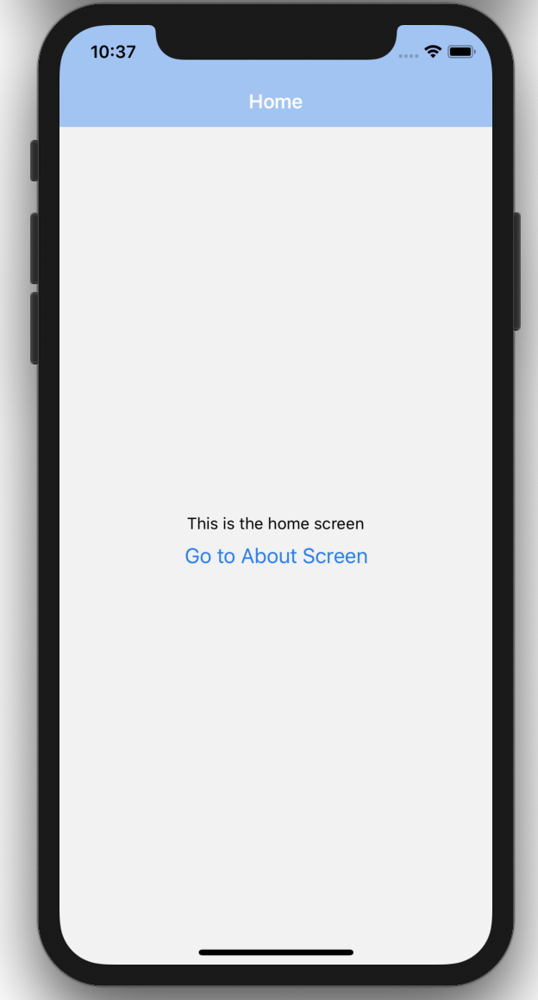
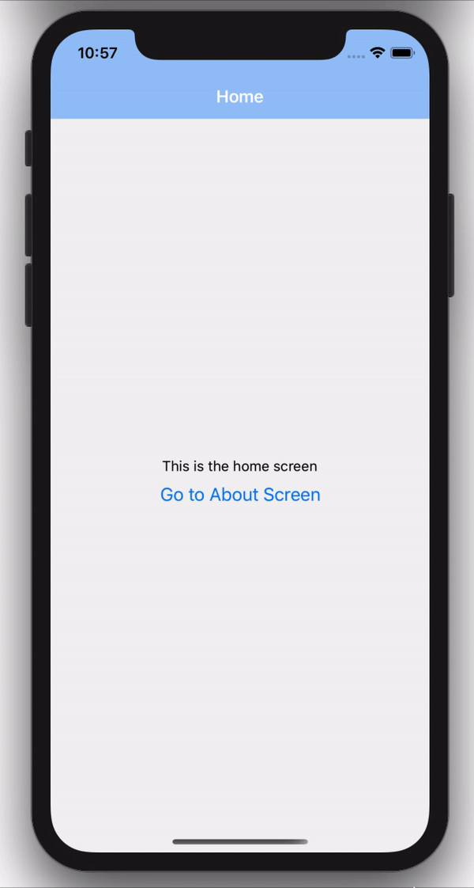
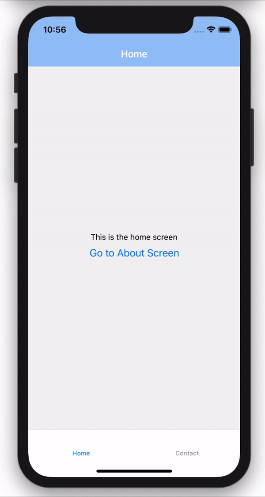
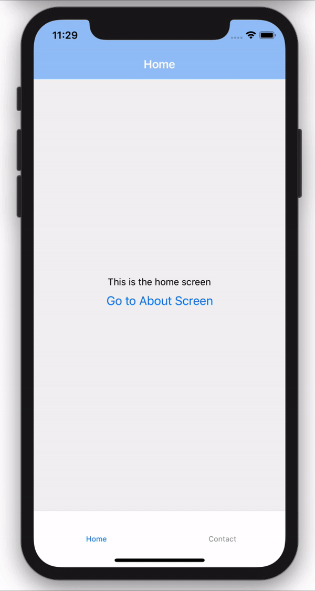

<!-- "Step-by-step: Navigations in React Native Navigation"

React Router with TypeScript: The Complete Guide - Completion is important!

REACT NATIVE NAVIGATION & HOW TO COMBINE THEM

How to use React Router with TypeScript - Simple and straightforward

Step-by-step: How to use React Router with TypeScript - Promises to approach the topic in small steps

Use React Router with TypeScript (2020 Guide) - Tells you the material is up-to-date -->

In this article, we'll be covering the different types of navigations in react native using react navigation 5 and also how to combine the different navigations together.

### Table Of Content

- Setup
- Setup Screens

### Prerequesites

- Using expo starter
- I'd be making use of react-navigation 5 in this article

Setup a react native project

### React Navigation Dependencies & Setup

Install the dependencies below

---

The dependency below is the core dependencie of react navigation

- Stack Navigation
- Tab navigation
- Drawer navigation

```
npm install @react-navigation/native @react-navigation/stack @react-navigation/bottom-tabs @react-navigation/drawer
```

These dependencies below are the dependency relied upon for animations and ...

```
npm install react-native-reanimated react-native-gesture-handler react-native-screens react-native-safe-area-context @react-native-community/masked-view
```

In the root file of our app, in this case the **App.js** file, we would setup our react navigation there.

```js
// ./App.js

import React from "react";
import { NavigationContainer } from "@react-navigation/native";

export default function App() {
  return <NavigationContainer>{/* Navigation here */}</NavigationContainer>;
}
```

### Screens setup

Next step would be to setup screens that would be used in our application.

I'd be setting up 3 screens for the purpose of this demo, feel free to just copy them.

So I'd set them up in a screens directory. So create a screens directory **src/screens** and add the components below

**Home Screen**

```js
// src/screens/Home.jsx

import React from "react";
import { View, Button, Text, StyleSheet } from "react-native";

const Home = () => {
  return (
    <View style={styles.center}>
      <Text>This is the home screen</Text>
      <Button title="Go to About Screen" />
    </View>
  );
};

const styles = StyleSheet.create({
  center: {
    flex: 1,
    justifyContent: "center",
    alignItems: "center",
    textAlign: "center",
  },
});

export default Home;
```

**About Screen**

```js
// src/screens/About.jsx

import React from "react";
import { View, StyleSheet, Text } from "react-native";

const About = () => {
  return (
    <View style={styles.center}>
      <Text>This is the about screen</Text>
    </View>
  );
};

const styles = StyleSheet.create({
  center: {
    flex: 1,
    justifyContent: "center",
    alignItems: "center",
    textAlign: "center",
  },
});

export default About;
```

**Contact Screen**

```js
// src/screens/Contact.jsx

import React from "react";
import { View, StyleSheet, Text } from "react-native";

const Contact = () => {
  return (
    <View style={styles.center}>
      <Text>This is the contact screen</Text>
    </View>
  );
};

const styles = StyleSheet.create({
  center: {
    flex: 1,
    justifyContent: "center",
    alignItems: "center",
    textAlign: "center",
  },
});

export default Contact;
```

<!-- - Stack Navigation
- Tab Navigation
- Drawer Navigation -->

### Stack Navigation

The stack navigation provides a way for your react native apps to transition between screens by using a stack, that means the screens are stacked on each other. 

For example, if you navigate from login to signup screen, the signup screen is stacked on top of the login screen, and if you navigate back, the signup screen is then popped off the stack.

To setup the stack navigation, I'd create a **navigation** directory in the root of our project. Inside our newly created directory, I'd also create a **StackNavigator.js** file in there, and add our Stack navigation setup.

**Note: You can decide to name the folders and files however you want**

```js
// navigation/StackNavigator.js

import React from "react";
import { createStackNavigator } from "@react-navigation/stack";

import Home from "../screens/Home";
import About from "../screens/About";

const Stack = createStackNavigator();

function MainStackNavigator() {
  return (
    <Stack.Navigator>
      <Stack.Screen name="Home" component={Home} />
      <Stack.Screen name="About" component={About} />
    </Stack.Navigator>
  );
}

export { MainStackNavigator };
```

You can also customize and style the stack navigation by passing `screenOptions` style, see basic example below

```js
function MainStackNavigator() {
  return (
    <Stack.Navigator
      screenOptions={{
        headerStyle: {
          backgroundColor: "#9AC4F8",
        },
        headerTintColor: "white",
        headerBackTitle: "Back",
      }}
    >
      <Stack.Screen name="Home" component={Home} />
      <Stack.Screen name="About" component={About} />
    </Stack.Navigator>
  );
}
```

Back in our **App.js** file, we can import and add our newly created Stack Navigator. So our **App.js** file would look like the code below

```js
// ./App.js

import React from "react";
import { NavigationContainer } from "@react-navigation/native";

import { MainStackNavigator } from "./navigation/StackNavigator";

export default function App() {
  return (
    <NavigationContainer>
      <MainStackNavigator />
    </NavigationContainer>
  );
}
```

Now if we run the code on our emulator, We should now see our Home screen rendering on our Stack screens.



Remember in our `src/screens/Home.jsx` file, we had a button that did nothing, but since we have our stack navigation setup, we can now have access to navigation prop injected by the stack navigation which can help us perform many operations, one of which is redirecting.

So navigate to `src/screens/Home.jsx` and add the code below.

```js
import React from "react";
import { View, Button, Text, StyleSheet } from "react-native";

const Home = ({ navigation }) => {
  return (
    <View style={styles.center}>
      <Text>This is the home screen</Text>
      <Button
        title="Go to About Screen"
        onPress={() => navigation.navigate("About")}
      />
    </View>
  );
};

const styles = StyleSheet.create({
  center: {
    flex: 1,
    justifyContent: "center",
    alignItems: "center",
    textAlign: "center",
  },
});

export default Home;
```

In the code above, we get the navigation prop, which is an object that has a navigate function which we then call passing in the name of the screeen we want to navigate to after the button is pressed.



And there we have it, we can now navigate between screens using our stack navigation.

### Tab Navigation

A tab navigation is tabbed at either the bottom or top of a screen and can be used to switch between different screens.

Tab navigation can take in either the screen as component or a Stack as the component

In our `StackNavigator.js` file, let's create another stack for contact. So our `StackNavigator.js` will look like below

```js
// navigations/MainStackNavigator.js

import React from "react";
import { createStackNavigator } from "@react-navigation/stack";

import Home from "../screens/Home";
import About from "../screens/About";
import Contact from "../screens/Contact";

const Stack = createStackNavigator();

const screenOptionStyle = {
  headerStyle: {
    backgroundColor: "#9AC4F8",
  },
  headerTintColor: "white",
  headerBackTitle: "Back",
};

function MainStackNavigator() {
  return (
    <Stack.Navigator screenOptions={screenOptionStyle}>
      <Stack.Screen name="Home" component={Home} />
      <Stack.Screen name="About" component={About} />
    </Stack.Navigator>
  );
}

function ContactStackNavigator() {
  return (
    <Stack.Navigator screenOptions={screenOptionStyle}>
      <Stack.Screen name="Contact" component={Contact} />
    </Stack.Navigator>
  );
}

export { MainStackNavigator, ContactStackNavigator };
```


We can create another file in the `navigations` directory and create a `TabNavigator.js` file, and add the markup below

```js
// navigations/TabNavigator.js

import React from 'react';
import { createBottomTabNavigator } from '@react-navigation/bottom-tabs';

import { MainStackNavigator, ContactStackNavigator } from './StackNavigator'

const Tab = createBottomTabNavigator();

const BottomTabNavigator = () => {
  return (
    <Tab.Navigator>
      <Tab.Screen name="Home" component={MainStackNavigator} />
      <Tab.Screen name="Contact" component={ContactStackNavigator} />
    </Tab.Navigator>
  );
}

export default BottomTabNavigator
```

And then back in our `App.js` file, we can now import our newly created `TabNavigator` and use it there.

```js
//  App.js

import React from "react";
import { NavigationContainer } from "@react-navigation/native";

import BottomTabNavigator from "./navigation/TabNavigator";

export default function App() {
  return (
    <NavigationContainer>
      <BottomTabNavigator />
    </NavigationContainer>
  );
}

```




### Drawer Navigation
A drawer navigation is....

In order to create a drawer navigation, we would create another file in our `navigations` directory called `DrawerNavigator`

In that file, we would add our drawer navigator markup
```js
import React from "react";

import { createDrawerNavigator } from "@react-navigation/drawer";

import { ContactStackNavigator } from "./StackNavigator";
import TabNavigator from "./TabNavigator";

const Drawer = createDrawerNavigator();

function DrawerNavigator() {
  return (
    <Drawer.Navigator>
      <Drawer.Screen name="Home" component={TabNavigator} />
      <Drawer.Screen name="Contact" component={ContactStackNavigator} />
    </Drawer.Navigator>
  );
}

export default DrawerNavigator;

```

And then back in our `App.js` file, we can now import our newly created `DrawerNavigtor` and use it there.

```js
import React from "react";
import { NavigationContainer } from "@react-navigation/native";

import DrawerNavigator from "./navigation/DrawerNavigator";

export default function App() {
  return (
    <NavigationContainer>
      <DrawerNavigator />
    </NavigationContainer>
  );
}

```



There are also configuration options and header icons you can add to make your drawer navigation. Find out more [here](https://reactnavigation.org/docs/header-buttons).

### Combining NAvigations

### Conclusion
