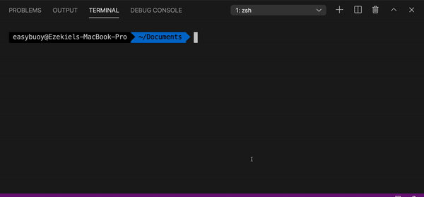
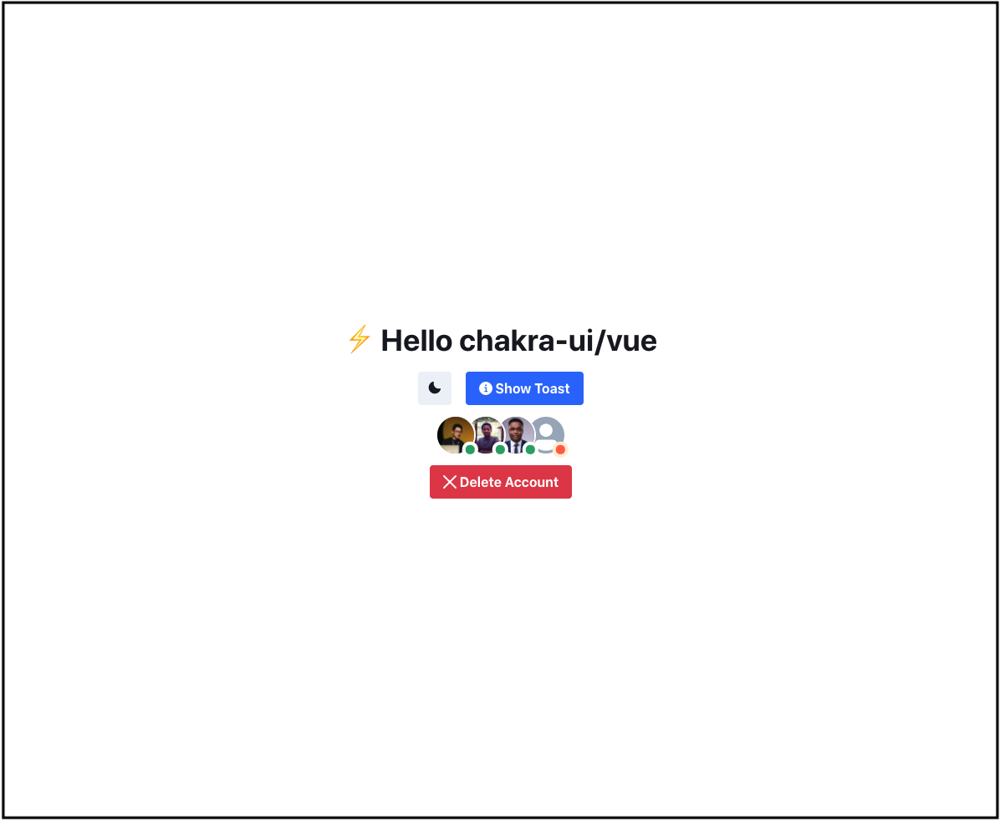
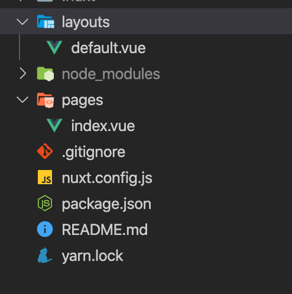
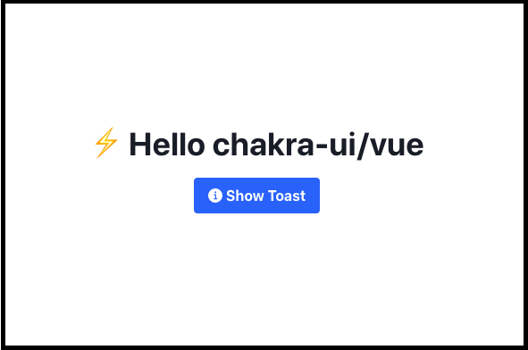

In this article, we'll be covering the different ways to set up and configure the `chakra-ui-vue` library for a Nuxt application.

## **Table Of Content**

- [Prerequisite](#prerequisite)
- [What is Nuxt](#what-is-nuxt)
- [What is Chakra UI Vue](#what-is-chakra-ui)
- [Setup Nuxt App](#setup-nuxt-app)
  - [Using Create-Nuxt-App](#using-create-nuxt-app)
  - [Starting From Scratch](#starting-from-scratch)
    - [Setting up Nuxt From Scratch](#setting-up-nuxt)
    - [Setting Up Chakra UI Vue](#setting-up-chakra-ui)
- [Conclusion](#conclusion)

## **Prerequisite** <a name="prerequisite"></a>

To be able to follow up with this article, you must have the following setup on your local environment

- [Node](https://nodejs.org) installed.

## **What is Nuxt** <a name="what-is-nuxt"></a>

Nuxt.js is a free and open-source progressive framework based on Vue.js to create modern web applications. Find out more [here](https://nuxtjs.org/guide).

## **What is Chakra UI Vue** <a name="what-is-chakra-ui"></a>

Chakra UI Vue gives you a set of accessible and composable Vue components that you can use to build your favorite applications and sites. Find out more [here](https://vue.chakra-ui.com).

## **Setup Nuxt App** <a name="setup-nuxt-app"></a>

There are two ways of setting up a Nuxt application, either by [starting from scratch](#starting-from-scratch) or using the [create-nuxt-app](#using-create-nuxt-app).

### **Using Create-Nuxt-App** <a name="using-create-nuxt-app"></a>

The create-nuxt-app is a quick and easy way to get started using nuxt. It creates a boilerplate app that is customizable to your needs.

You can install or create a Nuxt.js application by using `npx` or `yarn`. To create one, run the command below on your terminal

```
npx create-nuxt-app <project-name>
```

Where `<project-name>` in the above command is the name of the project you want to create.

**Note: The npx command comes bundled with npm versions 5.2.0 and above. If you use [yarn](https://yarnpkg.com), you can run `yarn create nuxt-app <project-name>` on your terminal to create your nuxt application.**

The above command would prompt you with some questions, and configurations you want for the project. When it prompts for the UI framework, make sure to select the **Chakra UI** option. See example in the gif below



Once you've followed through with the prompts, and the installation is finished, navigate to the project directory on your code editor, open a terminal and run `npm run dev`, or `yarn dev` to start the application.

Once started, click on the generated link and open in the browser, you should see the same as the example in the image below.



And that's it, you've been able to create a Nuxt application bootstrapped with Chakra UI Vue, you can go ahead to build out your application using Chakra UI Vue components. Find out more about the create-nuxt-app setup [here](https://github.com/nuxt/create-nuxt-app).

### **Starting from Scratch** <a name="starting-from-scratch"></a>

If you have an already existing nuxt project, you can skip to [Setting up Chakra UI Vue](#setting-up-chakra-ui) section, but if you want to set up a nuxt project from scratch, you can follow the next steps below

- **Setting up Nuxt** <a name="setting-up-nuxt"></a>

To setup Nuxt from scratch, create a project folder on your system and open the folder in your code editor.

The first step is to initialize a package.json file by running the command below

```
npm init -y
```

The next step is to install the nuxt dependency by running the command below

```
npm install --save nuxt
```

Then add the scripts to the package.json

```json
 "scripts": {
    "dev": "nuxt",
    "build": "nuxt build",
    "start": "nuxt start"
  }
```

- Create a pages directory, in the root of the project, and create an index.vue file there.

Add the code below to the index.vue file

```html
<template>
  <p>Hello</p>
</template>
```

To run the app, run `npm run dev` on your terminal. Once the app is started, click on the generated link on your terminal to open the app in the browser. That's it, we've been able to set up a basic and functional nuxt application.

- **Setting up Chakra UI Vue** <a name="setting-up-chakra-ui"></a>

The first thing we need to do is to install chakra-ui-vue dependencies in our nuxt project. To do so, run the command below on your terminal.

```
npm install @chakra-ui/nuxt @nuxtjs/emotion
```

The next step is to create a `nuxt.config.js` file in the root of the project and add the configuration below

```js
export default {
  mode: "universal",
  head: {
    title: "Chakra UI Vue Starter",
    meta: [
      { charset: "utf-8" },
      { name: "viewport", content: "width=device-width, initial-scale=1" },
      {
        hid: "description",
        name: "description",
        content: "Chakra UI Vue integration with Nuxt starter",
      },
    ],
    link: [{ rel: "icon", type: "image/x-icon", href: "/favicon.ico" }],
  },

  modules: [
    "@chakra-ui/nuxt", // register the chakra-ui nuxt package
    "@nuxtjs/emotion", // register the emotion package which is being used by chakra-ui-vue
  ],
};
```

**Note: If you're using a pre-existing nuxt app, and already have a `nuxt.config.js` file, just add the `@chakra-ui/nuxt` and `@nuxtjs/emotion` to the modules section of the `nuxt.config.js` file.**

Create a `layouts` directory in the root of the project and then a `default.vue` file inside the layouts directory, and add the code below.

```html
<template>
  <div class="container">
    <CThemeProvider>
      <CColorModeProvider>
        <CBox font-family="body" as="main">
          <CReset />
          <Nuxt />
        </CBox>
      </CColorModeProvider>
    </CThemeProvider>
  </div>
</template>

<script>
  import {
    CThemeProvider,
    CColorModeProvider,
    CReset,
    CBox,
  } from "@chakra-ui/vue";

  export default {
    name: "App",
    components: {
      CThemeProvider,
      CColorModeProvider,
      CReset,
      CBox,
    },
  };
</script>
```

** The code above is needed to enable usage of the Chakra UI components in the application.**

Edit the `index.vue` file in the pages directory, and add the code below to test if `chakra-ui-vue` was set up properly.

```html
<template>
  <div class="container">
    <CBox d="flex" w="100vw" h="100vh" flex-dir="column" justify-content="center">
      <CHeading textAlign="center" mb="4">⚡️ Hello chakra-ui/vue</CHeading>
      <CFlex justify="center" direction="column" align="center">
        <CButton left-icon="info" variant-color="blue" @click="showToast">Show Toast</CButton>
      </CFlex>
    </CBox>
  </div>
</template>

<script lang="js">
import {
  CBox,
  CButton,
  CFlex,
  CHeading,
} from '@chakra-ui/vue'

export default {
  name: 'App',
  components: {
    CBox,
    CButton,
    CFlex,
    CHeading,
  },
  methods: {
    showToast () {
      this.$toast({
        title: 'Account created.',
        description: "We've created your account for you.",
        status: 'success',
        duration: 10000,
        isClosable: true
      })
    }
  }
}
</script>
```

If you followed the steps above properly, you should have a project structure similar to the image below



Once you're done with the steps above, start the application by running `npm run dev` or `yarn dev` on your terminal and you should have a page that looks like the image below on your browser



You can then go-ahead to continue building out your application using the [chakra-ui-vue](https://vue.chakra-ui.com) components.

### **Conclusion** <a name="conclusion"></a>

In this article, we've been able to look at what Nuxt and Chakra UI Vue are, and the different ways to set up Chakra UI Vue using Nuxt.

**Find more information about Nuxt [here](https://nuxtjs.org).**

**Find more information about Chakra UI Vue [here](https://vue.chakra-ui.com).**

**The source code used in demonstrating this article can be found [here](https://github.com/Easybuoy/chakra-ui-vue-nuxt-starter).**

If you have any questions or feedback about this article, feel free to reach out.

Thanks for reading.
